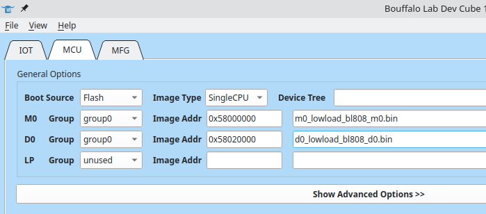
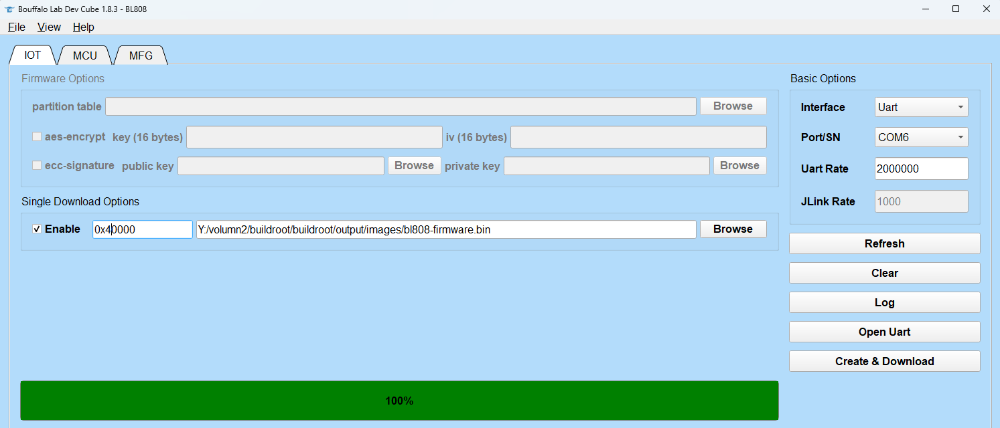

# Buildroot overlay for BL808 based boards

## Usage

```
git clone --recursive https://github.com/bouffalolab/buildroot_bouffalo.git
cd buildroot_bouffalo
export BR_BOUFFALO_OVERLAY_PATH=$(pwd)
cd buildroot
make BR2_EXTERNAL=$BR_BOUFFALO_OVERLAY_PATH bl808_nor_flash_defconfig
make
```
## Flashing Instructions

- Get DevCube **1.8.3** from https://dev.bouffalolab.com/media/upload/download/BouffaloLabDevCube-v1.8.3.zip (normal download location is http://dev.bouffalolab.com/download but 1.8.4 and later do not work, see #60)
- Connect BL808 board via serial port to your PC
- Set BL808 board to programming mode
    + Press BOOT button when reseting or applying power
    + Release BOOT button
- Run DevCube, select [BL808], and switch to [MCU] page
- Select the uart port and set baudrate with 2000000
    + UART TX is physical pin 1/GPIO 14.
    + UART RX is physical pin 2/GPIO 15.
- M0 Group[Group0] Image Addr [0x58000000] [PATH to m0_lowload_bl808_m0.bin]
- D0 Group[Group0] Image Addr [0x58020000] [PATH to d0_lowload_bl808_d0.bin]
- Click 'Create & Download' and wait until it's done



If you want to load linux, dtb and rootfs from flash, you need do as the following steps:
NorFlash layout:

file|description|size|offset
-|:-|:-|:-
m0_lowload_bl808_m0.bin	|M0 lowlevel loader				|128KB	|0x0	 
d0_lowload_bl808_d0.bin	|D0 lowlevel loader				|128KB	|0x20000 
bl808-firmware.bin     	|openspi+uboot+uboot dtb		|128KB	|0x40000 
*none*				   	|uboot Environment			    |64KB	|0xf0000 
bl808.itb				|linux kernel + dtb FIT image	|4MB	|0x100000
rootfs.squashfs			|RO rootfs						|8MB	|0x500000
*none*					|RW rootfs overlay				|3MB	|0xd00000


- Switch to [IOT] page
- Flash bl808-firmware.bin:
  - Enable 'Single Download', set Address to 0x40000, choose [bl808-firmware.bin]
  - Click 'Create & Download' again and wait until it's done



- Flash linux kernel & dtb
  - Enable 'Single Download', set Address to 0x100000, choose [bl808.itb]
  - Click 'Create & Download' again and wait until it's done

- Flash linux rootfs
  - Enable 'Single Download', set Address to 0x500000, choose [rootfs.squashfs]
  - Click 'Create & Download' again and wait until it's done

- Serial Console access:
    + UART TX is physical pin 32/GPIO 16.
    + UART RX is physical pin 31/GPIO 17.
    + Baud 2000000.

- Flash uboot environments.
	+ Reboot, press any key to stop autoboot and talk with uboot.
	+ It's okay if logs say that uboot fails to load environments from flash, because you never programmed them, type **printenv bootcmd**
	  and check if it is 'mtd read nor0 52000000 100000 400000', then type **saveenv**.
	+ This step is one-time and optional.

- Reboot and Enjoy!

## Compiling Applications for BL808 based boards

Buildroot provides a "SDK" for the boards. This is a tarball containing the cross compiler and sysroot for the target board. This can be used to compile applications for the board. Please refer to https://github.com/openbouffalo/buildroot_bouffalo/wiki/Building-Programs-outside-of-buildroot for basic instructions (or consult the [buildroot documentation](https://buildroot.org/downloads/manual/using-buildroot-toolchain.txt))

## Current Status of Linux

Please refer to the projects tab for the status of drivers in development.

## Disucssions

Please use the github discussions for any questions or issues.
